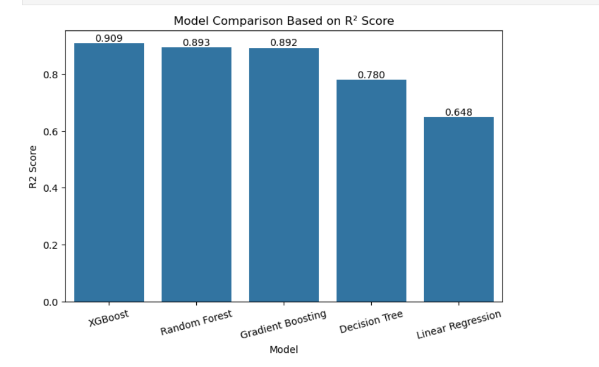
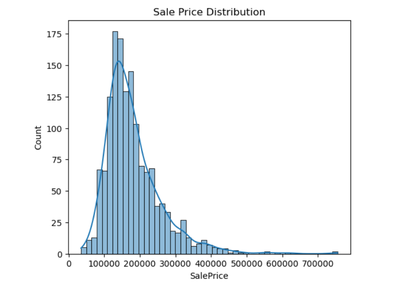
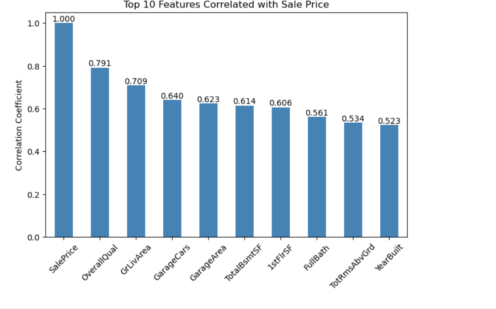
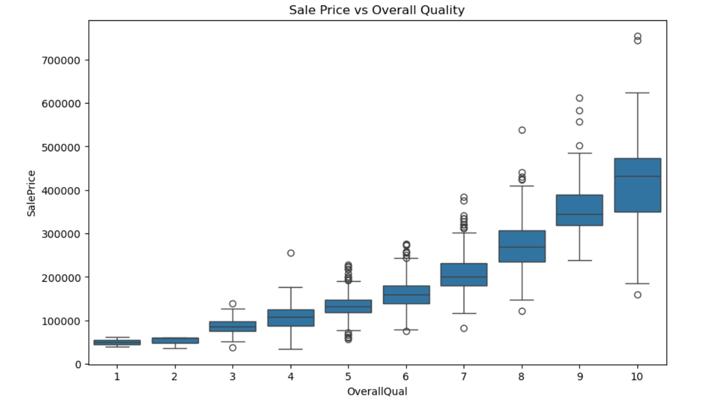
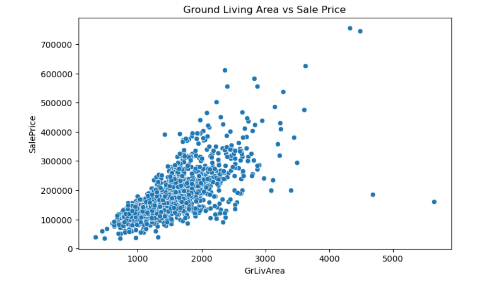
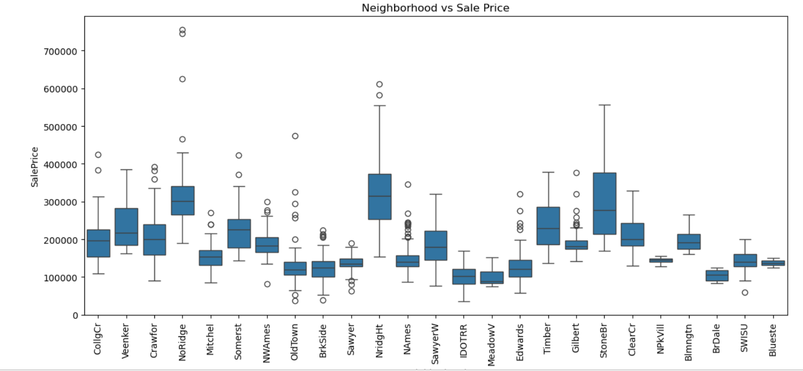

# 🏠 House Price Prediction using Machine Learning

A Machine Learning project that predicts house prices based on property features using multiple regression algorithms. This project demonstrates the complete machine learning workflow, including data preprocessing, exploratory data analysis (EDA), feature engineering, model training, evaluation, and model comparison.

---

## 📌 Project Overview

The objective of this project is to build an accurate predictive model that estimates house prices using various property attributes.

### Project Features

- 🧹 Data Cleaning
- 📊 Exploratory Data Analysis (EDA)
- ⚙️ Feature Engineering
- 📈 Data Visualization
- 🤖 Multiple Regression Models
- 📉 Model Evaluation
- 🏆 Model Comparison

---

## 🚀 Technologies Used

- Python
- NumPy
- Pandas
- Matplotlib
- Seaborn
- Scikit-learn
- XGBoost
- Jupyter Notebook

---

## 🤖 Machine Learning Models

- Linear Regression
- Decision Tree Regressor
- Random Forest Regressor
- XGBoost Regressor ⭐

---

## 📊 Project Workflow

1. Import Libraries
2. Load Dataset
3. Data Cleaning
4. Exploratory Data Analysis (EDA)
5. Feature Engineering
6. Train-Test Split
7. Model Training
8. Model Evaluation
9. Model Comparison
10. Conclusion

---

## 📈 Evaluation Metrics

The models were evaluated using the following regression metrics:

- Mean Absolute Error (MAE)
- Mean Squared Error (MSE)
- Root Mean Squared Error (RMSE)
- R² Score

---

## 🏆 Results

Four regression models were trained and evaluated to identify the most accurate model for predicting house prices.

### Model Performance Comparison

| Model | MAE ↓ | RMSE ↓ | R² Score ↑ |
|:------|------:|-------:|-----------:|
| **XGBoost Regressor ⭐** | **17,054.11** | **26,417.55** | **0.9090** |
| Random Forest Regressor | 17,519.71 | 28,647.75 | 0.8930 |
| Decision Tree Regressor | 27,088.63 | 41,079.41 | 0.7800 |
| Linear Regression | 20,384.19 | 51,992.05 | 0.6476 |

### Key Findings

- ✅ XGBoost achieved the highest **R² Score (0.9090)**.
- ✅ XGBoost produced the lowest prediction error (MAE & RMSE).
- ✅ Random Forest delivered competitive performance.
- ✅ Linear Regression served as the baseline model.
- 🚀 XGBoost is recommended as the production model for this dataset.

### 📊 Model Comparison



---

## 📂 Project Structure

```text
House-Price-Prediction/
│
├── House_Price_Prediction.ipynb
├── README.md
├── requirements.txt
├── .gitignore
├── LICENSE
└── images/
    ├── sale_price_distribution.png
    ├── top_correlated_features.png
    ├── overall_quality_vs_sale_price.png
    ├── ground_living_area_vs_sale_price.png
    ├── neighborhood_vs_sale_price.png
    └── model_comparison_r2_score.png
```

---

## 📸 Project Screenshots

### Sale Price Distribution



---

### Top Correlated Features



---

### Overall Quality vs Sale Price



---

### Ground Living Area vs Sale Price



---

### Neighborhood vs Sale Price



---

### Model Comparison (R² Score)


---

## 🔮 Future Improvements

- Hyperparameter Tuning
- Cross Validation
- LightGBM
- Streamlit Deployment
- REST API using FastAPI
- Docker Deployment

---

## 👨‍💻 Author

**Ashok Poondla**

- 💼 LinkedIn: https://www.linkedin.com/in/ashok-poondla/
- 💻 GitHub: https://github.com/Ashokpoondla

---

## ⭐ Support

If you found this project useful, consider giving it a ⭐ on GitHub!
